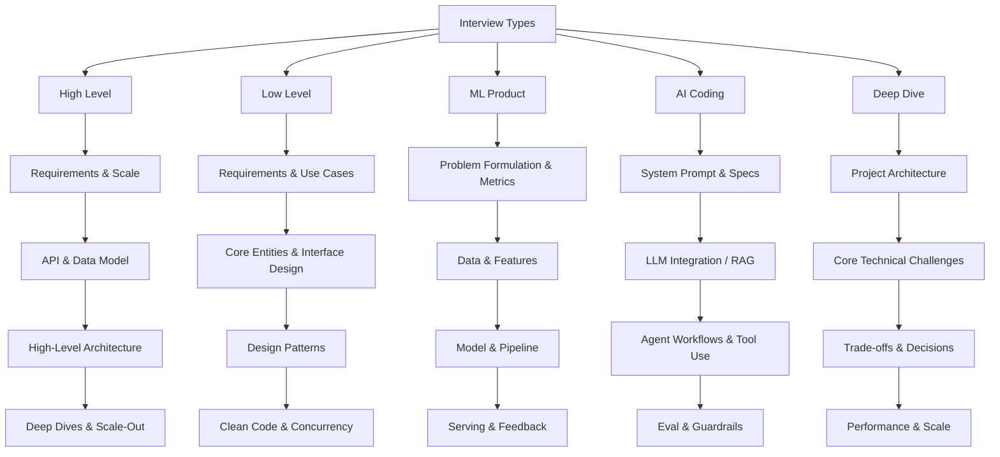

# System Design Practice

A structured repository for practicing and organizing software engineering interview preparation across 5 critical domains, featuring templates, frameworks, and questions inspired by **Hello Interview**, **FAANG interviews**, and modern system engineering.

## 🗂️ Repository Structure

This repository is organized into 5 primary categories of practice:

1. **[High-Level System Design](file:///Users/adityamhaske/.gemini/antigravity-ide/scratch/system-design-practice/high-level-system-design/README.md)**
   * Large-scale distributed systems design.
   * Focuses on requirements gathering, API design, database schema, scale calculations, architecture, and handling bottlenecks.
2. **[Low-Level Design (LLD / OOD)](file:///Users/adityamhaske/.gemini/antigravity-ide/scratch/system-design-practice/low-level-design/README.md)**
   * Object-oriented design, class design, design patterns, and clean code.
   * Focuses on modularity, extensibility, concurrency, and SOLID principles.
3. **[ML Product & Systems](file:///Users/adityamhaske/.gemini/antigravity-ide/scratch/system-design-practice/ml-product/README.md)**
   * Machine learning system design and product integration.
   * Focuses on feature engineering, model selection, evaluation metrics, serving architecture, and online evaluation (A/B testing).
4. **[AI Coding & Agents](file:///Users/adityamhaske/.gemini/antigravity-ide/scratch/system-design-practice/ai-coding/README.md)**
   * Coding with AI assistance, RAG pipelines, Agentic workflows, LLM integration, and prompt engineering.
   * Focuses on programmatic interaction with LLMs, orchestration frameworks, and AI-native application architectures.
5. **[Deep Dive Projects](file:///Users/adityamhaske/.gemini/antigravity-ide/scratch/system-design-practice/deep-dive-projects/README.md)**
   * Detailed case studies of complex projects, custom engines, database internals, and performance-critical systems.

---

## 🎯 Interview Frameworks & Cheat Sheet

To succeed in FAANG and top-tier interviews, consistency and structured communication are key. Below are the recommended frameworks for each interview type.

### 📚 Recommended Resources
- [Hello Interview](https://www.hellointerview.com/) - The premier resource for system design and LLD.
- [ByteByteGo (Alex Xu)](https://bytebytego.com/) - Great visual high-level design guides.
- [Grokking the System Design Interview](https://www.designgurus.io/) - Foundational system design questions.
- [Designing Data-Intensive Applications](https://www.oreilly.com/library/view/designing-data-intensive-applications/9781491903063/) - The bible for deep-dive system architecture.
