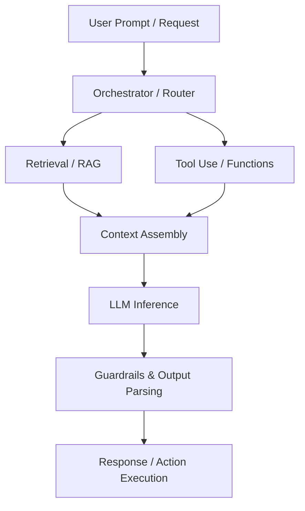

# AI Coding & Agentic Systems

This section focuses on designing and implementing systems that leverage Large Language Models (LLMs), Retrieval-Augmented Generation (RAG), and agentic workflows. As AI-native systems become standard, engineering interviews evaluate your ability to design robust, cost-effective, and low-latency AI pipelines.

---

## 📐 AI & Agentic System Design Framework

Use this structured framework when designing or building AI-centric applications:

### 1. Context & Retrieval (RAG)
- **Document Ingestion**: Parsing, chunking strategy (sliding window, semantic chunking), embedding model selection.
- **Vector DB & Retrieval**: Indexing (HNSW, IVF), metadata filtering, keyword + dense hybrid search (reciprocal rank fusion).
- **Reranking**: Using Cohere/Cross-encoders to filter top-k documents before feeding them to the prompt context to fit context windows and reduce noise.

### 2. Orchestration & Agent Workflows
- **Routing**: Classifying user intent to route to specific system prompts or databases.
- **Agent Patterns**:
  - *ReAct (Reasoning + Acting)*: LLM generates thoughts and executes actions in loops.
  - *Plan-and-Solve*: LLM creates a plan first, then executes it sequentially.
  - *Multi-Agent Systems*: Dedicated agents (e.g., Coder, Tester, Manager) collaborating via structured state.
- **Orchestration Libraries**: LangChain, LlamaIndex, Google Antigravity (AGY) SDK, Autogen, CrewAI.

### 3. Tool Use & Function Calling
- Defining clean JSON schemas for tools/functions that the model can invoke.
- Handling execution sandboxing, credential injection, error recovery (retries on bad tool args), and loop detection.

### 4. Evaluation & Guardrails
- **Guardrails**: Prompt injection prevention, PII masking, safety filtering (Llama Guard, NeMo Guardrails).
- **Evaluation**: Ragas framework, G-Eval, LLM-as-a-judge for assessing response faithfulness, relevance, and accuracy.
- **Latency & Cost**: Input/output token tracking, prompt caching, model quantization, semantic caching of queries.

---

## 📝 Practice Projects & Notebooks

| Date | Practice Project | Architecture / Stack | Core AI Pattern | Key Learnings / Review Notes | Status |
| :--- | :--- | :--- | :--- | :--- | :--- |
| | **RAG System from Scratch** | Python, ChromaDB, Gemini/OpenAI | Chunking, Embeddings, Reranking | Semantic chunking, hybrid search implementation, token cost reduction. | 📋 Todo |
| | **AI Coding Agent** | AGY SDK / LangChain | Tool Use, Self-correction loop | Parsing terminal errors, writing system files, safety bounds. | 📋 Todo |
| | **Customer Support Router** | FastAPI, LLM Function Calling | Intent Routing, Prompt engineering | Semantic router latency, structured output parsing. | 📋 Todo |
| | **Multimodal Data Extractor** | Python, Gemini Flash | Vision processing, JSON parsing | Schema-based structured outputs, processing tables in PDFs. | 📋 Todo |
| | **LLM Eval Pipeline** | Ragas / LLM-as-a-Judge | Offline metrics evaluation | Setting up ground truth datasets, tracking drift. | 📋 Todo |
