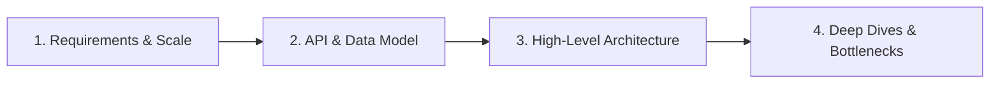

# High-Level System Design (HLD)

This section focuses on designing large-scale distributed systems. High-level system design interviews evaluate your ability to scope a ambiguous problem, design an end-to-end architecture, and scale it to millions of users under various constraints.

---

## 📐 The Hello Interview HLD Framework

Use this structured 4-step framework to navigate any HLD interview:

### 1. Requirements & Scale (First 5-10 mins)
- **Functional Requirements**: What is the system *actually* doing? (Limit to 3-4 core features).
- **Non-Functional Requirements**: Scale (DAU/MAU), Read/Write ratio, Latency SLA (e.g., <200ms), Availability (e.g., 99.99%), Consistency vs. Availability (CAP Theorem).
- **Back-of-the-Envelope Estimation**: 
  - DAU $\times$ operations per day = QPS (Average and Peak).
  - Storage requirements over 1-5 years (e.g., photos, text, logs).
  - Network bandwidth requirements (Ingress/Egress).

### 2. API Design & Data Model (Next 10 mins)
- **API Endpoints**: Write down the REST APIs or gRPC definitions.
  - E.g., `POST /v1/tweets` -> body: `{ text, media_ids }` -> returns: `201 Created { tweet_id }`
- **Data Model (Schema)**:
  - Relational vs. NoSQL decision.
  - SQL Schema: Primary key, foreign keys, indices.
  - NoSQL (Cassandra/DynamoDB) Schema: Partition key, Clustering key.

### 3. High-Level Architecture (Next 10-15 mins)
- Draw or describe the core flow from Client -> DNS -> Load Balancer -> API Gateway -> Microservices -> Database/Cache.
- Explain data ingestion flow vs. read query flow.

### 4. Scale and Deep Dives (Remaining time)
- **Bottlenecks**: Where does the system break under 100x load?
- **Scaling Strategies**:
  - **Caching**: Read-through, write-through, cache eviction (LRU).
  - **Database Scaling**: Sharding (horizontal partitioning), replication (master-slave), read replicas.
  - **Asynchronous Processing**: Message Queues (Kafka/RabbitMQ) for decoupling.
  - **Data/Object Storage**: CDN for static files, GCS/S3.

---

## 📝 Practice Questions Log

Keep track of your practice sessions here. Focus on questions frequently asked in FAANG and curated by Hello Interview.

| Date | Question Name | Source / Difficulty | Focus Areas | Key Learnings / Review Notes | Status |
| :--- | :--- | :--- | :--- | :--- | :--- |
| | [Design TinyURL](https://www.hellointerview.com/learn/system-design/problem-common/url-shortener) | Hello Interview / Easy | Key generation, Hashing, Base62 | Base62 encoding, pre-generating keys, caching redirects. | 📋 Todo |
| | [Design YouTube/Netflix](https://www.hellointerview.com/learn/system-design/problem-common/netflix) | Hello Interview / Hard | Video chunking, CDN, Ingestion pipeline | Transcoding async pipelines, adaptive bitrate streaming (HLS/DASH). | 📋 Todo |
| | [Design Uber/Lyft](https://www.hellointerview.com/learn/system-design/problem-common/uber) | Hello Interview / Hard | Geospatial indexing, Quadtree/S2 | Quadtree vs S2, geospatial index updates, WebSockets. | 📋 Todo |
| | [Design Ticketmaster](https://www.hellointerview.com/learn/system-design/problem-common/ticketmaster) | Hello Interview / Medium | Concurrency, Transaction isolation, Locking | Distributed locks (Redis/Zookeeper), database transactions. | 📋 Todo |
| | [Design Twitter/X Feed](https://www.hellointerview.com/learn/system-design/problem-common/twitter) | Hello Interview / Medium | Fan-out on read vs. write, Redis Cache | Push vs. Pull models, hybrid approaches for celebrities. | 📋 Todo |
| | [Design Messenger/WhatsApp](https://www.hellointerview.com/learn/system-design/problem-common/messenger) | Hello Interview / Hard | WebSockets, Message queue, Presence indicator | WebSocket gateways, heartbeat checks, message delivery status. | 📋 Todo |
| | [Design Web Crawler](https://www.hellointerview.com/learn/system-design/problem-common/web-crawler) | Hello Interview / Medium | Distributed scheduling, Deduplication | DNS resolver cache, Robots.txt manager, Bloom filters for URL dedup. | 📋 Todo |
