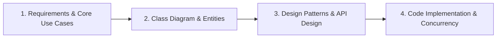

# Low-Level Design (LLD) & Object-Oriented Design (OOD)

This section focuses on object-oriented programming (OOP), SOLID principles, design patterns, clean code, and concurrency. LLD interviews evaluate your ability to translate abstract business requirements into modular, readable, maintainable, and extensible code.

---

## 📐 The LLD Interview Framework

Use this structured 4-step framework to navigate any LLD/OOD interview:

### 1. Requirements & Use Cases (First 5 mins)
- Define the system boundaries and what is out of scope.
- Enumerate core actors (e.g., Customer, Admin, System).
- List functional use cases (e.g., `reserveParkingSlot()`, `makePayment()`).

### 2. Core Entities & Interface Design (Next 10 mins)
- Identify primary objects/entities (nouns in requirements).
- Define attributes and methods for each entity.
- Map relationships:
  - **Inheritance** (is-a): E.g., `Car` extends `Vehicle`.
  - **Composition/Aggregation** (has-a): E.g., `ParkingLot` has multiple `ParkingFloor`s.
  - **Association**: E.g., `Driver` drives a `Vehicle`.

### 3. Design Patterns & SOLID Principles (Next 5-10 mins)
- Apply relevant design patterns:
  - **Creational**: Singleton (e.g., Database connection), Factory/Abstract Factory (e.g., `VehicleFactory`), Builder (e.g., complex `Reservation`).
  - **Structural**: Decorator (e.g., adding features to a base subscription), Strategy (e.g., different payment methods like Card, PayPal, Crypto).
  - **Behavioral**: Observer (e.g., notifying users of slot availability), State (e.g., `VendingMachineState`).
- Keep code aligned with **SOLID** principles:
  - **S**ingle Responsibility Principle
  - **O**pen/Closed Principle
  - **L**iskov Substitution Principle
  - **I**nterface Segregation Principle
  - **D**ependency Inversion Principle

### 4. Code Implementation & Concurrency (Remaining time)
- Implement core use cases cleanly.
- Handle **Concurrency & Thread Safety** (extremely important in LLD):
  - Use synchronized blocks/locks (e.g., ReentrantLocks in Java).
  - Thread-safe data structures (e.g., ConcurrentHashMap).
  - Double-checked locking.

---

## 📝 Practice Questions Log

Keep track of your LLD practice sessions here.

| Date | Question Name | Design Patterns Involved | Concurrency Strategy | Key Learnings / Review Notes | Status |
| :--- | :--- | :--- | :--- | :--- | :--- |
| | [Design Parking Lot](https://www.hellointerview.com/learn/system-design/problem-common/parking-lot) | Factory, Singleton, Strategy | Locks on Slot allocation | Abstracting slot types, computing ticket fees dynamically. | 📋 Todo |
| | [Design Vending Machine](https://www.hellointerview.com/learn/system-design/problem-common/vending-machine) | State Pattern | Synchronized purchase transaction | State transitions (Idle, HasMoney, Dispensing, OutOfStock). | 📋 Todo |
| | [Design Movie Ticket Booking System](https://www.hellointerview.com/learn/system-design/problem-common/movie-booking) | Strategy, Command | Optimistic locking on Seat Booking | Handling double booking, temporary seat locks with TTL. | 📋 Todo |
| | [Design Splitwise](https://www.hellointerview.com/learn/system-design/problem-common/splitwise) | Strategy (Expense split strategies) | Concurrency control on balance updates | Handling exact/unequal/percentage splits, group settlement algorithms. | 📋 Todo |
| | [Design Chess Game](https://www.hellointerview.com/learn/system-design/problem-common/chess) | Factory, Command (for undo moves) | Turn-based state locking | Representing board, validation of piece moves, tracking history. | 📋 Todo |
| | [Design Library Management System](https://www.hellointerview.com/learn/system-design/problem-common/library-management) | Factory, Observer | Read-write locks on book inventory | Handling reservation queues, fine calculation strategy. | 📋 Todo |
