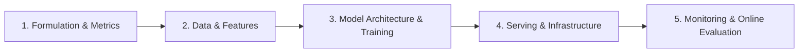

# ML Product & System Design

This section focuses on designing machine learning systems that run in production. ML system design interviews evaluate your ability to formulate a business problem as an ML task, select features, design training pipelines, architect scalable serving infrastructures, and monitor models in production.

---

## 📐 The ML System Design Framework

Use this structured 5-step framework to navigate any ML product/system interview:

### 1. Problem Formulation & Metrics (First 5-10 mins)
- **Goal**: What business problem are we solving? (E.g., increase user click-through rate, detect spam).
- **ML Formulation**: Binary classification, multi-class classification, regression, ranking (pointwise/pairwise/listwise), recommendation.
- **Metrics**:
  - *Offline Metrics*: AUC-ROC, Precision/Recall, F1-score, Log Loss, NDCG (for ranking), MAP, MAE/RMSE.
  - *Online (Business) Metrics*: CTR (Click-Through Rate), Conversion Rate, Revenue, Session duration, user retention.

### 2. Data Preparation & Feature Engineering (Next 10 mins)
- **Data Collection**: Where does the training data come from? (User logs, static metadata). How do we handle labeling (implicit feedback, human labeling)?
- **Feature Engineering**:
  - *User features*: Demographics, historical clicks, device type.
  - *Item features*: Category, popularity, price, embeddings.
  - *Context features*: Time of day, location, current query.
- **Handling Data Challenges**: Imbalanced classes (downsampling/upsampling), missing values, feature scaling, high-cardinality features.

### 3. Model Architecture & Selection (Next 10 mins)
- **Baseline Model**: Start simple! (Logistic Regression, Decision Trees, Heuristics).
- **Advanced Model**: Deep learning, Gradient Boosted Trees (XGBoost/LightGBM), Matrix Factorization, Two-Tower architectures.
- **Training Strategy**: Loss function choice, Hyperparameter tuning, handling overfitting (regularization, dropout).

### 4. Serving & Scale Architecture (Next 10 mins)
- **Serving Pipeline**:
  - *Batch (Offline) inference*: Generate predictions overnight, write to Cache/DB (e.g., daily recommendations).
  - *Online (Real-time) inference*: Generate predictions on the fly. Requires low-latency serving (<50ms).
  - *Hybrid*: Candidate generation (heavy filter, fast offline or simple online retrieval) -> Candidate ranking (complex online ML model ranking top 100 items).
- **Infrastructural Components**: Feature Store (Tecton, Feast), Model Registry, Cache (Redis), Vector Database (Pinecone, Milvus) for embedding search.

### 5. Monitoring, Evaluation & Feedback Loops (Remaining time)
- **A/B Testing**: How to safely transition to the new model (traffic splitting, canary deployments).
- **Monitoring**: Metric tracking, detection of **Data Drift** and **Concept Drift**.
- **Feedback Loops**: How new user interactions are logged and used to retrain the model.

---

## 📝 Practice Questions Log

Keep track of your ML system design practice sessions here.

| Date | Question Name | ML Formulation | Core Serving Strategy | Key Metrics (Offline / Online) | Status |
| :--- | :--- | :--- | :--- | :--- | :--- |
| | [Design Search Ranking](https://www.hellointerview.com/learn/system-design/problem-common/search-ranking) (e.g., Google/Amazon) | Ranking / Learning to Rank | Two-tower retrieval + deep ranker | NDCG, MAP / Conversion Rate, CTR | 📋 Todo |
| | [Design Recommendation System](https://www.hellointerview.com/learn/system-design/problem-common/recommendation-system) (e.g., YouTube/Netflix) | Retrieval + Ranking | Candidate Gen (Vector Search) + Ranking | Precision@K, NDCG / Watch time, Retention | 📋 Todo |
| | [Design Ad Click Prediction](https://www.hellointerview.com/learn/system-design/problem-common/ad-prediction) | Binary Classification | Real-time low-latency online inference | Log Loss, AUC-ROC / Revenue, CTR | 📋 Todo |
| | [Design Fraud Detection System](https://www.hellointerview.com/learn/system-design/problem-common/fraud-detection) | Binary Classification | Real-time inference + Rule engine | Precision-Recall AUC / False Positive Rate | 📋 Todo |
| | [Design Feed Recommendation](https://www.hellointerview.com/learn/system-design/problem-common/feed-recommendation) (e.g., TikTok/Instagram) | Multi-task Learning | Real-time streaming features + ranking | Engagement, CTR / Session time, DAU | 📋 Todo |
